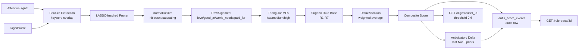

# ANFIS-Ikigai Attention Scorer — v0 architecture

The v0 prototype is the foundational primitive for purpose-grounded
attention routing across the Trinity Symphony / HyperDAG / RepID stack.
This doc captures the architecture, the principles it codifies, and the
upgrade path. It is paired with `docs/P-014-REDUCTION-TO-PRACTICE.md`,
which is patent-attorney-facing.

---

## 1. Architecture overview

### Module map

| Layer | File | Responsibility |
|---|---|---|
| Schema | `supabase/migrations/20260426_anfis_ikigai_v0.sql` | Six tables + indices |
| Schema | `supabase/migrations/20260426_anfis_ikigai_seed.sql` | Rule base + Sean's profile |
| Service | `src/services/anfis-ikigai-mfs.ts` | Triangular / shoulder MFs |
| Service | `src/services/anfis-ikigai-rules.ts` | Sugeno rule base |
| Service | `src/services/anfis-lasso-pruner.ts` | Feature pruning |
| Service | `src/services/anfis-anticipatory.ts` | Trend metric |
| Service | `src/services/anfis-ikigai-scorer.ts` | Entry point |
| Routes  | `src/routes/v1.ts` | Six HTTP endpoints |
| Tests   | `tests/anfis-ikigai-scorer.test.ts` | 18 tests + 20-signal suite |

## 2. Architectural principles

The five principles below were extracted from the design conversation
and are the load-bearing reasons the v0 looks the way it does. Every
v1 candidate must preserve them.

### 2.1 Persistent stateful channels beat stateless calls

The scorer assumes the user's `IkigaiProfile` is *durable* and
*versioned* (`ikigai_profiles.profile_version` is monotonic). Every
score event references both the signal *and* the profile version that
scored it. v1 learning loops will diff between profile versions —
which is only possible because the channel is stateful.

### 2.2 Latency is opportunity

v0's <50ms target is not a vanity metric. Sub-50ms means the scorer
can sit on the request path of every interactive surface (voice
turn, chat reply, mobile poll) without becoming the bottleneck. This
locks out future temptations to put an LLM in the critical path.

### 2.3 ANFIS at every decision point

Decisions inside the engine that *could* be ad-hoc heuristics are
instead expressed as fuzzy rules with explicit firing strengths. The
seven seed rules are not the final word — they are the place v1's
learning loop will tune. Anything that should be tunable goes into
the rule base, not into hand-coded `if` statements.

### 2.4 Reward grounded in declared purpose, not engagement

The composite score is a function of the user's declared ikigai
profile. There is no "predicted dwell time" or "click-through
likelihood" feature anywhere in the pipeline. Rule R6 makes the
anti-engagement stance explicit: high love-membership combined with
low good_at and low world_needs *reduces* the score. This is the
philosophical heart of P-014.

### 2.5 Multi-source signals with explicit attestation

`attention_signals.source_type` and `source_id` are first-class. A
parked idea, a tweet, a query, an internal Trinity message all share
the same row shape. v1 ingestors plug in without schema changes.

## 3. v0 limitations (and why each is OK)

| Limitation | Why it's OK in v0 |
|---|---|
| Keyword-only feature extraction | Keeps the scorer deterministic and offline. Embedding swap is local to one function. |
| Fixed MF parameters | The shoulder-triangular shape is the *correct* default — only the parameters need tuning, not the architecture. |
| LASSO pruner with uniform-1.0 weights | The pruning *contract* is exercised; weights become non-uniform once v1 has feedback data. |
| Single-user (Sean) dogfood | The schema is multi-tenant from day 1. No data-model change needed for v1. |
| No voice / no UI | Voice-first PurposeHub UI is a *consumer* of this primitive, not part of it. |
| Sugeno consequents are constants | Zero-order Sugeno is the cleanest base case; first-order consequents (linear functions of antecedents) are a v1 candidate. |
| 7 seed rules | Sufficient to demonstrate Rule 6's anti-engagement-economy effect; rule learning is v1. |

## 4. v1 candidates

In rough priority order. None of them are part of v0; this section
is here so future contributors don't accidentally pull v1 work into
v0 PRs.

1. **Embedding-based feature extraction.** Replace keyword substring
   match with cosine similarity against per-dimension embedding
   centroids. Same `FeatureVector` contract.
2. **Online LASSO learning loop.** Train `lasso_feature_weights`
   from `user_feedback_events` via L1 regression. Triggered nightly
   per profile.
3. **PPO-ANFIS membership-function tuning.** Treat MF parameters
   (peak, base widths) as learnable; reward = predicted feedback
   alignment.
4. **Trapezoidal MF for paid_for.** Real income-alignment data
   tends to have a satisficing band, not a single peak.
5. **First-order Sugeno consequents.** Each consequent becomes a
   linear function of antecedent memberships, learned per rule.
6. **Voice-first surface.** PurposeHub.ai entry surface that
   consumes `/digest/:user_id` and presents the surfaced signals as
   a daily voice briefing.
7. **HyperDAG anchoring.** `audit_chain_hash` is reserved on
   `anfis_score_events` for exactly this; the `auditChainWriter`
   pattern from `src/services/auditChainWriter.ts` plugs in.
8. **Multi-tenancy hardening.** RLS policies on the six new tables
   keyed on `ikigai_profiles.user_id`.

## 5. Integration points

| System | Today | v1+ |
|---|---|---|
| HAL v2 (`hal-tiered-consensus`) | Independent | Could feed `attention_signals` from HAL-flagged claims; share audit-chain anchoring. |
| Trinity Supabase (`trinity_tasks`) | Independent | A surfaced high-composite signal could auto-spawn a `trinity_task`. |
| Telegram (`src/routes/telegram.ts`) | Independent | Nightly digest delivery via `sendTelegramAlert`. |
| HyperDAG protocol | Independent | `audit_chain_hash` slot is ready for chain anchoring. |
| RepID scoring engine | Independent | Could weight `paid_for` evidence by RepID tier of the source. |

## 6. Operational checklist

- All six new tables are created with `IF NOT EXISTS`; the migration
  is idempotent.
- The seed migration uses `WHERE NOT EXISTS` for both Sean's profile
  and each of the seven seed rules, also idempotent.
- The scorer is process-pure — it carries no in-memory state across
  requests beyond what's in Supabase.
- The route layer respects the project-wide SQL-keyword body
  sanitizer (see `src/index.ts`); user prose containing `SELECT `,
  `;`, `--`, etc. is rejected at the edge. Tests bypass this by
  calling `scoreSignal()` directly.
