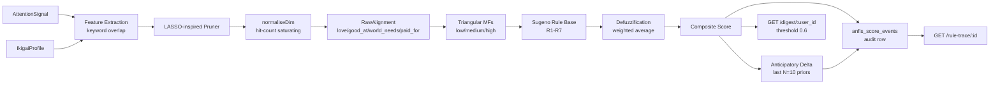
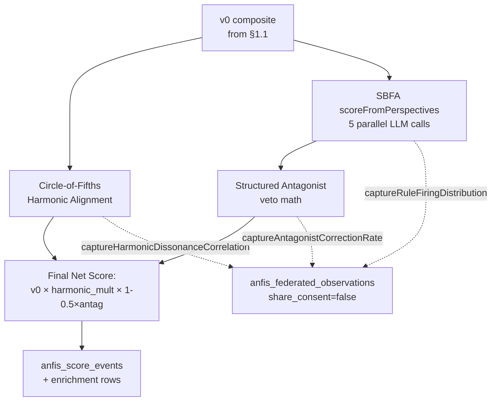

# ANFIS-Ikigai Attention Scorer — architecture (v0 + v0.1)

The v0 prototype is the foundational primitive for purpose-grounded
attention routing across the Trinity Symphony / HyperDAG / RepID stack.
v0.1 layers four extensions on top of v0 — Circle-of-Fifths harmonic
alignment, SBFA multi-perspective scoring, structured antagonist
evaluation, and federated-observation capture (schema-only). This doc
captures both the v0 baseline and the v0.1 extensions; it is paired with
`docs/P-014-REDUCTION-TO-PRACTICE.md`, which is patent-attorney-facing.

`scoreSignal()` accepts a `mode` parameter. `'v0'` (default) preserves the
exact v0 contract for back-compat. `'v0.1-fast'` adds harmonic alignment
(no LLM calls). `'v0.1-full'` adds SBFA + antagonist (5 parallel LLM
calls; mock-mode fallback).

---

## 1. Architecture overview

### 1.1 v0 pipeline (mode='v0')



### 1.2 v0.1 pipeline (mode='v0.1-full')



### 1.3 Module map

| Layer | File | Responsibility |
|---|---|---|
| Schema (v0)   | `supabase/migrations/20260426_anfis_ikigai_v0.sql`     | Six v0 tables |
| Schema (v0)   | `supabase/migrations/20260426_anfis_ikigai_seed.sql`   | Rule base + Sean's profile |
| Schema (v0.1) | `supabase/migrations/20260426_anfis_ikigai_v01.sql`    | Five v0.1 tables + COF config seed |
| Service (v0)  | `src/services/anfis-ikigai-mfs.ts`                     | Triangular / shoulder MFs |
| Service (v0)  | `src/services/anfis-ikigai-rules.ts`                   | Sugeno rule base |
| Service (v0)  | `src/services/anfis-lasso-pruner.ts`                   | Feature pruning |
| Service (v0)  | `src/services/anfis-anticipatory.ts`                   | Trend metric |
| Service (v0.1) | `src/services/anfis-circle-of-fifths.ts`              | Harmonic alignment + Pythagorean Comma |
| Service (v0.1) | `src/services/anfis-llm-providers.ts`                 | Local LLM adapter (mirrors hal-providers signature) |
| Service (v0.1) | `src/services/anfis-sbfa-perspectives.ts`             | 5-role multi-LLM perspective scorer |
| Service (v0.1) | `src/services/anfis-antagonist.ts`                    | Structured antagonist + veto math |
| Service (v0.1) | `src/services/anfis-federated-prep.ts`                | 4 federated-pattern capture functions |
| Service       | `src/services/anfis-ikigai-scorer.ts`                  | Entry point with `mode` switch |
| Routes        | `src/routes/v1.ts`                                     | 11 HTTP endpoints (6 v0 + 5 v0.1) |
| Tests         | `tests/anfis-ikigai-scorer.test.ts`                    | 18 v0 tests, 20-signal suite |
| Tests         | `tests/anfis-ikigai-v01.test.ts`                       | 17 v0.1 tests, 30-signal suite |

## 2. Architectural principles

The five principles below were extracted from the design conversation
and are the load-bearing reasons the v0 looks the way it does. Every
v1 candidate must preserve them.

### 2.1 Persistent stateful channels beat stateless calls

The scorer assumes the user's `IkigaiProfile` is *durable* and
*versioned* (`ikigai_profiles.profile_version` is monotonic). Every
score event references both the signal *and* the profile version that
scored it. v1 learning loops will diff between profile versions —
which is only possible because the channel is stateful.

### 2.2 Latency is opportunity

v0's <50ms target is not a vanity metric. Sub-50ms means the scorer
can sit on the request path of every interactive surface (voice
turn, chat reply, mobile poll) without becoming the bottleneck. This
locks out future temptations to put an LLM in the critical path.

### 2.3 ANFIS at every decision point

Decisions inside the engine that *could* be ad-hoc heuristics are
instead expressed as fuzzy rules with explicit firing strengths. The
seven seed rules are not the final word — they are the place v1's
learning loop will tune. Anything that should be tunable goes into
the rule base, not into hand-coded `if` statements.

### 2.4 Reward grounded in declared purpose, not engagement

The composite score is a function of the user's declared ikigai
profile. There is no "predicted dwell time" or "click-through
likelihood" feature anywhere in the pipeline. Rule R6 makes the
anti-engagement stance explicit: high love-membership combined with
low good_at and low world_needs *reduces* the score. This is the
philosophical heart of P-014.

### 2.5 Multi-source signals with explicit attestation

`attention_signals.source_type` and `source_id` are first-class. A
parked idea, a tweet, a query, an internal Trinity message all share
the same row shape. v1 ingestors plug in without schema changes.

## 3. v0 limitations (and why each is OK)

| Limitation | Why it's OK in v0 |
|---|---|
| Keyword-only feature extraction | Keeps the scorer deterministic and offline. Embedding swap is local to one function. |
| Fixed MF parameters | The shoulder-triangular shape is the *correct* default — only the parameters need tuning, not the architecture. |
| LASSO pruner with uniform-1.0 weights | The pruning *contract* is exercised; weights become non-uniform once v1 has feedback data. |
| Single-user (Sean) dogfood | The schema is multi-tenant from day 1. No data-model change needed for v1. |
| No voice / no UI | Voice-first PurposeHub UI is a *consumer* of this primitive, not part of it. |
| Sugeno consequents are constants | Zero-order Sugeno is the cleanest base case; first-order consequents (linear functions of antecedents) are a v1 candidate. |
| 7 seed rules | Sufficient to demonstrate Rule 6's anti-engagement-economy effect; rule learning is v1. |

## 3.5 v0.1 design choices

### Circle of Fifths and the Pythagorean Comma

The four ikigai dimensions sit on a circle in canonical order
`love → good_at → world_needs → paid_for → love`. Adjacent pairs are
"perfect fifths apart" in the musical analogue. Adjacent distance is
`|a-b| / max(a,b,ε)`; mean of the four pair distances gives a 0-1
dissonance summary, and `resonance_score = 1 - mean_distance`.

When ANY adjacent distance exceeds the dissonance threshold
(default `0.0136`, equal to `Pythagorean Comma - 1`), the pipeline
flips `dissonance_flag=true` and emits a `composite_multiplier =
531441/524288 ≈ 1.0136433` — the **same constant** HAL v1 uses for
hallucination detection. One mathematical primitive, two decision
surfaces; this is the single architectural symmetry P-014 §3.5
captures.

### SBFA — five orthogonal perspectives

Each scoring run dispatches five parallel LLM calls, one per role,
each going to a different model family so per-model bias can't
masquerade as perspective disagreement:

| Role | Default model | Argument |
|---|---|---|
| protagonist | claude-haiku-4-5 | Surface this |
| antagonist | gpt-5-mini | Don't surface this |
| naive_user | gemini-2.5-flash | Would a fresh user benefit RIGHT NOW? |
| long_term_self | claude-haiku-4-5 (different prompt) | Will future-you wish you'd seen this? |
| mission_aligned_peer | groq-llama-3.3-70b | Does this serve the last/lost/least? |

The aggregator computes `agreement_variance = stddev(scores)` and
flags `high_disagreement` when variance > 0.30 — that flag is itself
a federated learning signal.

`HAL_V2_MOCK=1` switches the LLM adapter to deterministic mock so
the orchestration logic can be tested without provider keys.

### Structured antagonist

The antagonist perspective from SBFA is promoted to a first-class
structured evaluation:

```
net_score = v0_composite × (1 - 0.5 × antagonist_score)
```

Veto threshold is 0.70. The structured row also captures
`counter_evidence_keywords` extracted from a small library of
engagement-bait markers (`hot take`, `ratios`, `dunking`, `clickbait`
…) so the audit trail is human-readable.

### Federated observations

Four pattern types capture v0.1-emitted data into
`anfis_federated_observations`, with `share_consent=false` on every
row by default:

1. `rule_firing_distribution` — which rules fired with what strength
2. `antagonist_correction_rate` — % of v0 scores adjusted ≥ 0.05
3. `harmonic_dissonance_correlation` — per-event dissonance + resonance
4. `feature_weight_drift` — hashed feature names + LASSO weights

Outbound federation is a v1 decision Sean still has to make. The
schema is ready; the network code is not.

## 4. v1 candidates

In rough priority order. None of them are part of v0 or v0.1;
this section is here so future contributors don't accidentally
pull v1 work into v0/v0.1 PRs.

1. **Embedding-based feature extraction.** Replace keyword substring
   match with cosine similarity against per-dimension embedding
   centroids. Same `FeatureVector` contract.
2. **Online LASSO learning loop.** Train `lasso_feature_weights`
   from `user_feedback_events` via L1 regression. Triggered nightly
   per profile.
3. **PPO-ANFIS membership-function tuning.** Treat MF parameters
   (peak, base widths) as learnable; reward = predicted feedback
   alignment.
4. **Trapezoidal MF for paid_for.** Real income-alignment data
   tends to have a satisficing band, not a single peak.
5. **First-order Sugeno consequents.** Each consequent becomes a
   linear function of antecedent memberships, learned per rule.
6. **Voice-first surface.** PurposeHub.ai entry surface that
   consumes `/digest/:user_id` and presents the surfaced signals as
   a daily voice briefing.
7. **HyperDAG anchoring.** `audit_chain_hash` is reserved on
   `anfis_score_events` for exactly this; the `auditChainWriter`
   pattern from `src/services/auditChainWriter.ts` plugs in.
8. **Multi-tenancy hardening.** RLS policies on the six new tables
   keyed on `ikigai_profiles.user_id`.

## 5. Integration points

| System | Today | v1+ |
|---|---|---|
| HAL v2 (`hal-tiered-consensus`) | Independent | Could feed `attention_signals` from HAL-flagged claims; share audit-chain anchoring. |
| Trinity Supabase (`trinity_tasks`) | Independent | A surfaced high-composite signal could auto-spawn a `trinity_task`. |
| Telegram (`src/routes/telegram.ts`) | Independent | Nightly digest delivery via `sendTelegramAlert`. |
| HyperDAG protocol | Independent | `audit_chain_hash` slot is ready for chain anchoring. |
| RepID scoring engine | Independent | Could weight `paid_for` evidence by RepID tier of the source. |

## 6. Operational checklist

- All six new tables are created with `IF NOT EXISTS`; the migration
  is idempotent.
- The seed migration uses `WHERE NOT EXISTS` for both Sean's profile
  and each of the seven seed rules, also idempotent.
- The scorer is process-pure — it carries no in-memory state across
  requests beyond what's in Supabase.
- The route layer respects the project-wide SQL-keyword body
  sanitizer (see `src/index.ts`); user prose containing `SELECT `,
  `;`, `--`, etc. is rejected at the edge. Tests bypass this by
  calling `scoreSignal()` directly.
