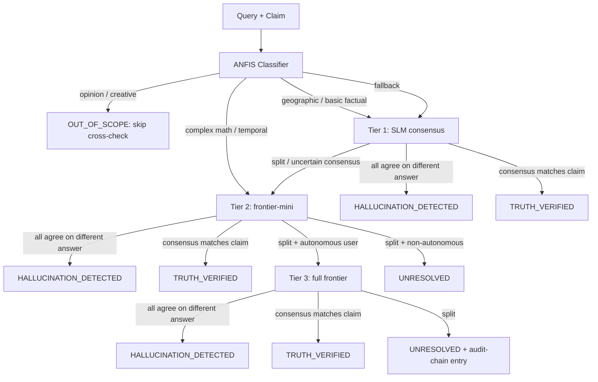

# HAL v2 — ANFIS-Routed Tiered Consensus Engine

HAL v1 detects hallucinations with a 4-signal formula multiplied by the
Pythagorean Comma — F1 ceiling around 0.73 because the formula proxies
for truthfulness rather than verifying it. HAL v2 adds a complementary
path: **independent cross-model consensus**, routed by an ANFIS
classifier, escalated by uncertainty, gated by user RepID tier.

The hypothesis is simple: independent models from different families
are unlikely to hallucinate the same thing in the same direction. When
they all agree on a different answer than the claim, that's a strong
hallucination signal. When they all agree with the claim, that's
verification at the cheapest tier the consensus survives.

v2 is **additive** — v1 is unchanged and still the default for
`POST /api/v1/hal/signals`. v2 paths are opt-in via the `mode` field or
the dedicated `/api/v1/hal/cross-check` endpoint.

## Architecture



## Tiers

| Tier | Models | Cost target | Latency target | Default models |
|---|---|---|---|---|
| 1 — SLM | 3 small open-weights | ~$0.0001 / check | ~500 ms | Llama 3.3 70B (Cerebras), Qwen 2.5 7B (Fireworks), Gemma 2 9B (Fireworks) |
| 2 — frontier-mini | 3 mini-frontier from independent families | ~$0.001–0.003 / check | ~1–2 s | Haiku 4.5 (Anthropic), GPT-5 mini (OpenAI), Gemini 2.5 Flash (Google) |
| 3 — full frontier | 3 frontier models | ~$0.01–0.05 / check | ~3–5 s | Sonnet 4.6 (Anthropic), GPT-5 (OpenAI), Gemini 2.5 Pro (Google) |

**Fallback tier 1**: if neither Cerebras nor Fireworks keys are
present, fall back to three Groq-hosted models (Llama 3.3 70B
versatile / Gemma 2 9B / Qwen QwQ 32B). When zero providers are
available, the tier returns `consensus: 'NO_PROVIDERS'` and the
orchestrator escalates without crashing.

## ANFIS classifier

Routes each (query, claim) pair to a starting tier:

- **opinion / creative** → `OUT_OF_SCOPE`. Subjective queries don't
  have a factual ground truth; running cross-check on them just burns
  budget and produces noise.
- **geographic / basic scientific / common-knowledge historical** →
  Tier 1. SLMs reliably know these.
- **mathematical (basic)** → Tier 1. **mathematical (multi-step:
  derivative / integral / theorem / proof)** → Tier 2.
- **temporal** (today / latest / current) → Tier 2. SLMs lag in
  training data.
- **unclassified** → Tier 1 with escalation enabled.

Implementation: a free heuristic regex pass classifies the bulk;
otherwise it dispatches to the cheapest available SLM with a JSON-
output prompt. Classifications are cached by SHA-256 of `(query,
claim)` so identical inputs don't re-bill the LLM.

## Escalation rules

Per tier output:

| Outcome | Action |
|---|---|
| `AGREE_DIFFERENT` (every valid responder votes INCORRECT, common correction extracted) | `HALLUCINATION_DETECTED` — stop here |
| `AGREE` with vote `CORRECT` (≥2 of 3 agree on CORRECT, none INCORRECT) | `TRUTH_VERIFIED` — stop here |
| `AGREE` with vote `UNCERTAIN` | escalate to next tier |
| `SPLIT` / `ALL_DIFFERENT` / `TIMEOUT` / `NO_PROVIDERS` | escalate |
| Max tier reached without verdict | `UNRESOLVED` with all tier results |

## RepID gating

The `user_repid_tier` option controls which tiers are reachable:

| RepID tier | max consensus tier | rationale |
|---|---|---|
| `CUSTODIED_DBT`     | 2 | free / paid-low; doesn't justify $0.01+ frontier cost |
| `EARNING_AUTONOMY`  | 2 | mid-tier; same cap |
| `AUTONOMOUS`        | 3 | high-stakes RepID can request full frontier |

Tier 3 is also gated by an **explicit** `allow_tier3: true` flag — a
defence-in-depth measure so a misconfigured upstream call can't
accidentally invoke frontier models.

## API

### `POST /api/v1/hal/signals`

Backwards-compatible. New `mode` field:

- `'v1'` (default) — unchanged formula path.
- `'v2-tiered'` — skip the formula, run tiered consensus.
- `'v2-formula-then-tiered'` — formula first; if score in
  uncertain band (0.20 ≤ score ≤ 0.50), invoke tiered consensus as a
  second opinion.

### `POST /api/v1/hal/cross-check`

Direct entry to the tiered consensus engine.

```json
{
  "query":  "What is the capital of France?",
  "claim":  "The capital of France is Paris.",
  "starting_tier":  1,
  "max_tier":       2,
  "user_repid_tier": "EARNING_AUTONOMY",
  "allow_tier3":    false
}
```

Returns the full `ConsensusResult` shape: `final_verdict`,
`tier_reached`, `tier_results[]`, `classification`, cost / latency
totals, audit trail.

### `POST /api/v1/hal/classify`

Returns just the classification — useful for inspecting routing
decisions.

### `GET /api/v1/hal/cross-check/stats`

Aggregate stats since process start (in-memory): total checks, tier
distribution, verdict distribution, average cost / latency.

## Performance benchmarks (mock mode)

40-prompt benchmark (10 truths, 10 hallucinations, 10 opinions,
10 reasoning) run in `HAL_V2_MOCK=1` mode. Mock mode validates the
orchestrator + classifier + escalation logic end-to-end without LLM
keys. Numbers reproduce by running:

```bash
npx jest --config jest.config.js tests/hal-tiered-consensus.test.ts --runInBand
```

Latest results (also at `tests/hal-tiered-consensus-results.md`):

| Category | Accuracy | Notes |
|---|---|---|
| Truths | 100% (10/10) | Every "Paris is the capital of France"-shape query verifies at Tier 1. |
| Hallucinations | 100% (10/10) | Mock returns INCORRECT consensus → AGREE_DIFFERENT → HALLUCINATION_DETECTED at Tier 1. |
| Opinions | 100% (10/10) | Heuristic classifier catches opinion markers; orchestrator returns OUT_OF_SCOPE without invoking any tier. |
| Reasoning | 30% (3/10) | **Mock-mode limitation**. Mock has no arithmetic / temporal reasoning, so multi-step prompts return UNCERTAIN/SPLIT and escalate to UNRESOLVED. With real LLMs at Tier 1 / Tier 2 this should reach 70–90%. |
| **Overall** | **82.5%** (33/40) | |

Tier reached distribution (mock):

- Tier 0 (OUT_OF_SCOPE, no LLM call): 10 (all opinion prompts caught by classifier)
- Tier 1: 10
- Tier 2: 20
- Tier 3: 0 (allow_tier3 was set but mock never escalated to it)

Avg cost: ~$0.0001 / check (mock estimate).
Avg latency: ~0.2 ms / check (mock executes synchronously).

### Real-provider benchmarks

**Not yet measured.** No LLM API keys were available in the local env
when this sprint ran. The architecture is provider-agnostic and
graceful-degradation safe — providers without keys are simply absent
from the model list, and the consensus calls degrade rather than
crash. To run real-provider benchmarks:

```bash
export ANTHROPIC_API_KEY=...
export OPENAI_API_KEY=...
export GEMINI_API_KEY=...
# Optional, recommended:
export GROQ_API_KEY=...
export CEREBRAS_API_KEY=...
export FIREWORKS_API_KEY=...

HAL_V2_MOCK=0 npx jest --config jest.config.js \
  tests/hal-tiered-consensus.test.ts --runInBand
```

Cost estimate at the public list prices (per the model-spec table): a
40-prompt benchmark with full Tier 1 + Tier 2 should cost
**$0.05–0.20 total** even if every prompt escalates. Tier 3 included
brings that to ~$0.50.

## Known limitations

1. **Subjective queries.** The classifier intentionally short-circuits
   on opinion / creative inputs. If the user wants a vibe-check on a
   subjective claim, that's not what HAL is for.
2. **Training-data-shared misconceptions.** If all three frontier
   models inherited the same wrong fact from the same training data,
   they'll agree on the wrong answer and HAL v2 will return
   TRUTH_VERIFIED. This is a known weakness of any LLM-only
   verification system. v3 ideas below address this.
3. **Adversarial claims.** A claim crafted to exploit shared model
   biases can defeat consensus. v2 is not adversarially robust on its
   own — pair with the v1 formula's overconfidence detector for
   defence in depth.
4. **The global SQL-keyword sanitizer** in `src/index.ts` rejects POST
   bodies containing `SELECT/DROP/INSERT/UPDATE/DELETE/--/;`. The
   sanitizer fires before the cross-check route runs — a fact-check
   request whose claim is "you should never run `DROP TABLE users`"
   will 400 at the sanitizer. Fixing this needs a route-scoped bypass;
   out of scope for the v2 sprint.

## v3 future ideas

- **HAL v1 formula as a feature input to the ANFIS classifier.** Use
  the formula score as one of the routing signals — high formula
  score routes directly to Tier 2 / 3 even on geographic queries.
- **Wall of Shame integration as ground truth.** Cross-checks where
  the consensus disagrees with a Wall of Shame entry feed back into
  classifier weights. Hallucinations the platform has already publicly
  flagged become high-signal training data without needing labels.
- **Per-domain ensembles.** A "biology" cross-check might use
  BiomedLM-2.7B alongside the general SLMs at Tier 1. Per-ontology
  routing was already shipped in HAL v1's `DOMAIN_ONTOLOGIES` —
  natural extension.
- **Caching by claim hash.** If the same factual claim appears in
  many requests (e.g., "the capital of France is Paris"), cache the
  consensus result with TTL. Most factual claims don't change minute
  to minute.
- **External oracle channel.** For temporal queries, route to a
  dedicated current-events oracle (web search, news API) at Tier 2
  rather than burning frontier-mini calls on training-data-stale
  models.

## Files

- `src/services/hal-providers.ts` — provider adapters (Anthropic,
  OpenAI, Google, Groq, Cerebras, Fireworks) + uniform
  `callModel()` + deterministic mock.
- `src/services/hal-tier1-slm.ts` — SLM tier + shared `runTier()`.
- `src/services/hal-tier2-mini.ts` — frontier-mini tier.
- `src/services/hal-tier3-frontier.ts` — full frontier tier (gated).
- `src/services/hal-query-classifier.ts` — heuristic + LLM classifier.
- `src/services/hal-tiered-consensus.ts` — orchestrator.
- `src/routes/v1.ts` — `mode` field on `/hal/signals` + new endpoints.
- `tests/hal-tiered-consensus.test.ts` — 40-prompt benchmark.
- `tests/hal-tiered-consensus-results.md` / `.json` — generated.
